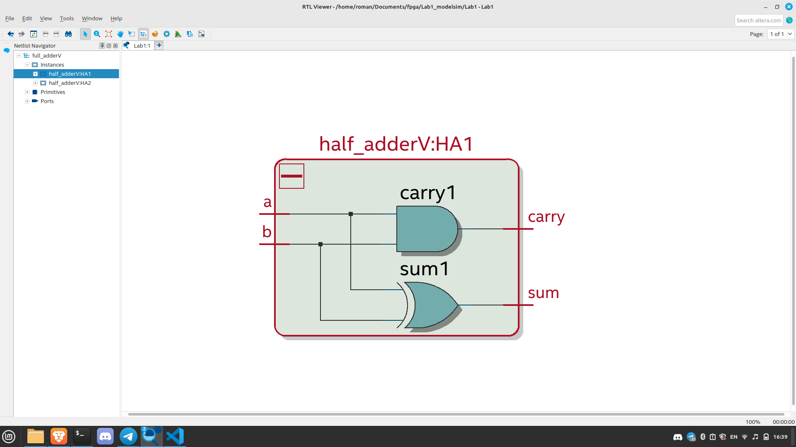
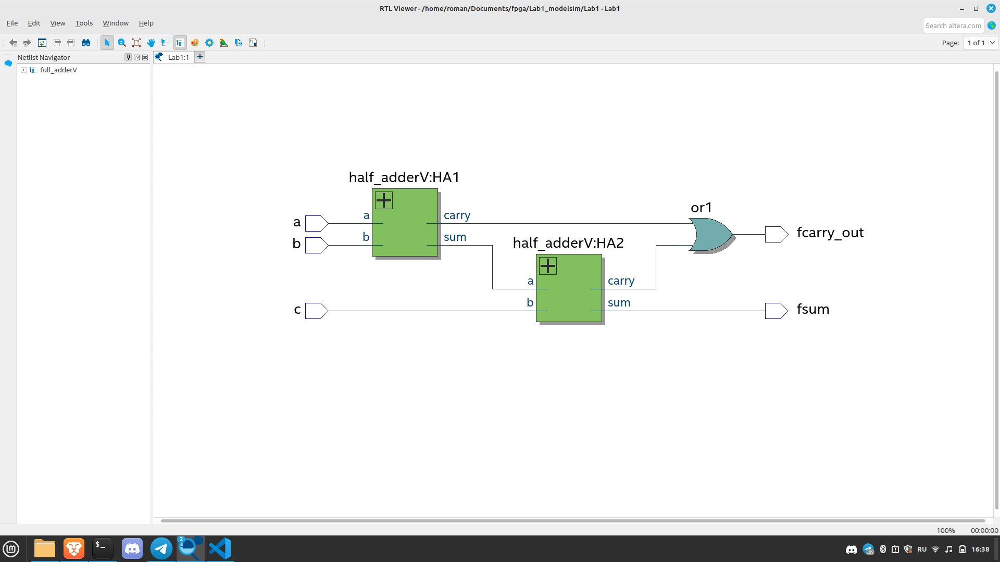
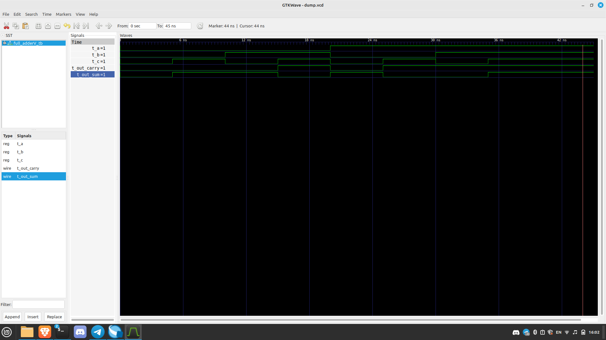

# 1 Задание 

Результаты синтеза примера:





К сожалению, на линукс modelsim в quartus не работает, поэтому все симуляции будут проводиться при помощи iverilog и gtkwave

Для дампа переменных, в testbench нужно добавить строку
```verilog
$dumpvars;
```

Чтобы провести симуляцию, нужно выполнить следующие команды: 
```console
fpga@mipt:~$ iverilog full_adderV_tb.v full_adderV.v half_adderV.v -o adder
fpga@mipt:~$ ./adder
fpga@mipt:~$ gtkwave dump.vcd
```

Результат симуляции:

