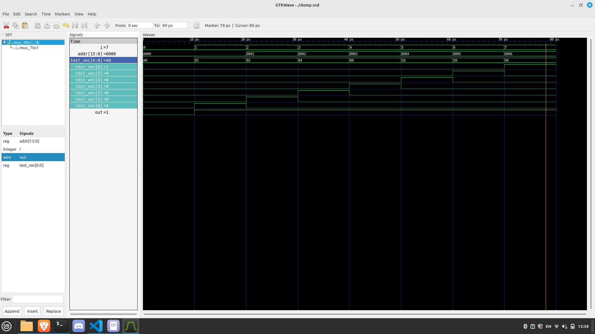

# 2 Задание

Код мультиплексора
```verilog
module mux_Nto1 #(parameter N = 5) (
    input [N-1:0] vec,
    input [15:0] addr,

    output wire res
);

assign res = vec[addr];

endmodule
```

Идея тестбенча строится на следующем цикле
```verilog
for(i = 0; i < 7; i = i+1)begin
        #10
        test_vec = 7'h0;
        test_vec[i] = 1;
        addr = i;
    end
```
test_vec подается на вход мультиплексора, addr на управляющий вход. в каждый момент времени в шине test_vec поднят только 1 бит. Если мультиплексор работает корректно, то его выход всегда будет равен 1.

Результаты симуляции:



