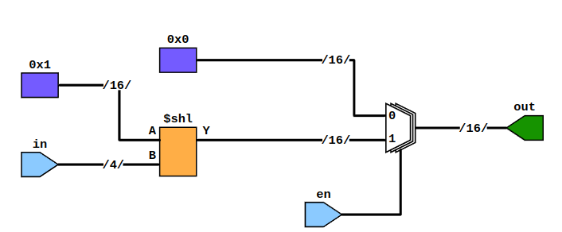

# Отчет по заданию №2 

## Статья №1 always блоки

### Пример №1

В этом примере демонстрируется поведение always блока без списка чувствительности. В таком реиме он работает как бесконечный цикл
```verilog
`timescale 1ps/1ps

module without_sens_tb ();

  reg clk = 0;

  always #10 clk = ~clk;

  initial
    begin
      $dumpvars;
      #100 $finish;
    end

endmodule

```
Результат исполнения файла always_wihout_sensitivity


### Пример №2

В данном примере реализуется t-flip-flop с помошью последовательностной логики. always блок реагирует на фронт тактового сигнала, а так же на изменение сигнала reset.

```verilog
module tff (input d,
              clk,
              rstn,
              output reg q);
  always @ (posedge clk or negedge rstn)
  begin
    if (!rstn)
      q <= 0;
    else
      if (d)
        q <= ~q;
      else
        q <= q;
  end
endmodule

```

На выходе плучаем последовательностную схему


Код тестбенча
```verilog
`include "./tff.v"
`timescale 1ps/1ps

module tff_tb();

reg d = 1;
reg clk = 1;
reg res = 0;
wire out;

always #1 clk = ~clk;

tff tff(.d(d), .clk(clk), .rstn(res), .q(out));

initial begin
    $dumpvars;
    #10 d = 0;
    #10 d = 1; res = 1;
    #10 d = 0;
    #10 $finish;
end

endmodule
```

И результаты симуляции seq_design.v


### Пример №3

Здесь реализуется следующая комбинационнная схема


Комбинационную логику можно получить, если в списке чувствительности указать все сигналы, входящие в rvalue.
```verilog
module combo ( input a,
                 input b,
                 input c,
                 input d,
                 output reg o);
  always @ (a or b or c or d)
  begin
    o <= ~((a & b) | (c^d));
  end
endmodule
```

Код тестбенча
```verilog
`include "combo.v"
`timescale 1ps/1ps

module combo_tb();

reg [3:0]inp = 0;
assign a = inp[0];
assign b = inp[1];
assign c = inp[2];
assign d = inp[3];
wire o;
integer i;

combo combo(.a(a), .b(b), .c(c), .d(d), .o(o));

initial begin 
    $dumpvars;
    for(i = 0; i < 16; i = i+1)begin 
        #2 inp = inp+1;
    end
    #2 $finish;
end

endmodule
```

Результаты симуляции


## Статья №2 Комбинационная логика

### Пример №1

В этом примере ничего принципиально нового нет. Просто комбинационная схема

```verilog
module combo ( input a, b, c, d, e,
                 output reg z);
  always @ ( a or b or c or d or e)
  begin
    z = ((a & b) | (c ^ d) & ~e);
  end
endmodule
```

Результат компиляции.


Тестовый модуль
```verilog
`include "combo.v"
`timescale 1ps/1ps

module combo_tb;

  reg a, b, c, d, e;
  wire z;
  integer i;

  combo combo ( .a(a), .b(b), .c(c), .d(d), .e(e), .z(z));
        initial
        begin
          $dumpvars;
            a <= 0;
          b <= 0;
          c <= 0;
          d <= 0;
          e <= 0;
          for (i = 0; i < 32; i = i + 1)
          begin
            {a, b, c, d, e} = i;
            #10;
          end
          #10 $finish;
        end
      endmodule
```

Результаты симуляции.


### Пример №2 Простейший сумматор

Простейший сумматор считает сумму двух бит, а так же бит переноса
```verilog
module ha ( input a, b,
              output reg sum, cout);
  always @ (a or b)
  begin
    {cout, sum} = a + b;
  end
endmodule
```

Результат синтеза


В тестбенче перебираем все возможные входы, и прверяем корректность результатов
```verilog
`include "ha.v"
`timescale 1ps/1ps

module ha_tb();

  reg a, b;
  wire sum, cout;
  integer i;

  ha ha ( .a(a), .b(b), .sum(sum), .cout(cout));
  initial
  begin
    $dumpvars;

    a <= 0;
    b <= 0;

    for (i = 0; i < 4; i = i + 1)
    begin
      {a, b} = i;
      #10;
    end
    $finish;
  end
endmodule
```

Результаты симуляции


### Пример №3 Полный сумматор
Теперь в сумме уситывается входной бит переноса
```verilog
module fa ( input a, b, cin,
              output reg sum, cout);
  always @ (a or b or cin)
  begin
    {cout, sum} = a + b + cin;
  end
endmodule
```

Результат синтеза


Тестбенч
```verilog
`include "fa.v"
`timescale 1ps/1ps

module fa_tb();
  reg a, b, cin;
  wire sum, cout;
  integer i;
  fa u0 ( .a(a), .b(b), .cin(cin), .sum(sum), .cout(cout));
  initial
  begin
    $dumpvars;
    a <= 0;
    b <= 0;
    for (i = 0; i < 8; i = i + 1)
    begin
      {a, b, cin} = i;
      #10;
    end
    $finish;
  end
endmodule
```

Результаты симуляции


### Пример №4 Мультиплексор

Мультиплексор с двумя входными сигналами и битом выбора удобно писать с применением тернарного оператора
```verilog
module mux (input a, b, sel,
                  output reg c);
  always @ ( a or b or sel)
  begin
    c = sel ? a : b;
  end
endmodule
```
Результат синтеза, тестбенч и симуляция


```verilog
`include "mux.v"
`timescale 1ps/1ps

module mux_tb();

  reg a, b, sel;
  wire c;
  integer i;
  mux mux ( .a(a), .b(b), .sel(sel), .c(c));
  initial
  begin
    $dumpvars;
    a <= 0;
    b <= 0;
    sel <= 0;
    for (i = 0; i < 8; i = i + 1)
    begin
      {a, b, sel} = i;
      #10;
    end
    $finish;
  end
endmodule
```


### Пример №5 Демультиплексор

Код и комбинационная схема.
```verilog
module demux ( input f,
                 input [1:0]sel, 
                 output reg a, b, c, d);
  always @ ( f or sel)
  begin
    a = f & ~sel[1] & ~sel[0];
    b = f & sel[1] & ~sel[0];
    c = f & ~sel[1] & sel[0];
    d = f & sel[1] & sel[0];
  end
endmodule
```


Тестовый модуль и результат симуляции

```verilog
`include "demux.v"
`timescale 1ps/1ps

module demux_tb();

  reg f;
  reg [1:0] sel;
  wire a, b, c, d;
  integer i;

  demux dem ( .f(f), .sel(sel), .a(a), .b(b), .c(c), .d(d));
  initial
  begin
    $dumpvars;
    f <= 0;
    sel <= 0;
    for (i = 0; i < 8; i = i + 1)
    begin
      {f, sel} = i;
      #10;
    end
    $finish;
  end
endmodule
```


### Пример №6 Декодер

Декодер преобразует число в позиционный код.
```verilog
module dec ( input en,
               input [3:0] in,
               output reg [15:0] out);
  always @ (en or in)
  begin
    out = en ? 16'b1 << in: 16'b0;
  end
endmodule
```

Синтезированая схема



Тестбенч и результат симуляции
```verilog
`include "dec.v"
`timescale 1ps/1ps

module tb;

  reg en;
  reg [3:0] in;
  wire [15:0] out;
  integer i;
  dec dec ( .en(en), .in(in), .out(out));

  initial
  begin
    $dumpvars;
    en = 0;
    in = 0;
    for (i = 0; i < 32; i = i + 1)
    begin
      {en, in} = i;
      #10;
    end
    $finish;
  end
endmodule
```


## Статья №3 Последовательностная логика

### Пример №1 JK flip flop

JK filp flop работает по следующей схеме


Значение на выходе обновляется по фронту тактового сигнала.

Код модуля
```verilog
module jkff ( input j,
                input k,
                input rstn,
                input clk,
                output reg q);
  always @ (posedge clk or negedge rstn)
  begin
    if (!rstn)
    begin
      q <= 0;
    end
    else
    begin
      q <= (j & ~q) | (~k & q);
    end
  end
endmodule
```
Синтезтрованная схема


Тестбенч и результаты симуляции.

```verilog
`include "jkff.v"
`timescale 1ps/1ps

module jkff_tb;

  reg j, k, rstn, clk;
  wire q;
  integer i;
  reg [2:0] dly;
  always #10 clk = ~clk;

  jkff jkff ( .j(j), .k(k), .clk(clk), .rstn(rstn), .q(q));

  initial
  begin
    $dumpvars;
    {j, k, rstn, clk} <= 0;
    #10 rstn <= 1;
    for (i = 0; i < 10; i = i+1)
    begin
      dly = $random;
      #(dly) j <= $random;
      #(dly) k <= $random;
    end
    #20 $finish;
  end
endmodule
```


### Пример №2 Счетчик по модулю 10

Код модуляи синтезированная схема 

```verilog
module mod10_cnt( input clk,
                    input rstn,
                    output reg[3:0] out);
  always @ (posedge clk)
  begin
    if (!rstn)
    begin
      out <= 4'b0;
    end
    else
    begin
      if (out == 10)
        out <= 4'b0;
      else
        out <= out + 4'b1;
    end
  end
endmodule
```


Тестбенч и результаты симуляции

```verilog
`include "mod10_cnt.v"
`timescale 1ps/1ps

module mod10_cnt_tb;
  reg clk, rstn;
  wire [3:0] out;
  mod10_cnt cnt ( .clk(clk), .rstn(rstn), .out(out));
  always #10 clk = ~clk;
  
  initial
  begin
    $dumpvars;
    {clk, rstn} <= 0;
    #10 rstn <= 1;
    #450 $finish;
  end
endmodule
```


### Пример №3 Сдвиговый регистр

Код модуля и схема
```verilog
module lshift( input d,
                 input clk,
                 input rstn,
                 output reg [3:0] out
               );
  always @ (posedge clk)
  begin
    if (!rstn)
    begin
      out <= 4'b0;
    end
    else
    begin
      out <= {out[2:0], d};
    end
  end
endmodule
```


Тестбенч и результаты моделирования

```verilog
`include "lshift.v"
`timescale 1ps/1ps

module lshift_tb;
  reg clk, rstn, d;
  wire [3:0] out;
  integer i;
  lshift lsh ( .d(d), .clk(clk), .rstn(rstn), .out(out));
  always #10 clk = ~clk;
  initial
  begin
    $dumpvars;
    {clk, rstn, d} <= 0;
    #10 rstn <= 1;
    for (i = 0; i < 20; i=i+1)
    begin
      @(posedge clk) d <= $random;
    end
    #10 $finish;
  end
endmodule
```

