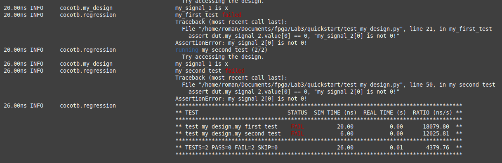

# Отчет по заданию №3

## Quickstart

Запустим Makefile, не меняя ничего в исходниках. Видим следующий вывод

Оба теста успешно пройдены.

 Теперь поменяем исходный код модуля. Запишем в my_signal_1 значение 1.

 ```verilog
 module my_design(input logic clk);

  timeunit 1ns;
  timeprecision 1ns;

  logic my_signal_1;
  logic my_signal_2;

  assign my_signal_1 = 1'b1;
  assign my_signal_2 = 0;

endmodule
 ```
Оба теста снова пройдены, так как не зависят от первого сигнала, но в консоли его значение изменилось


Теперь поменяем my_signal_2, чтобы нарушить тесты.
Получаем сообщение об ошибке
