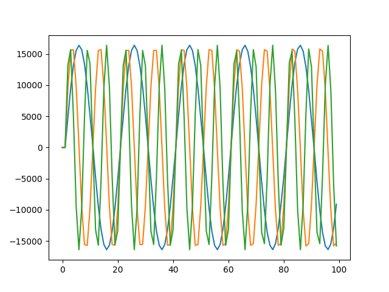
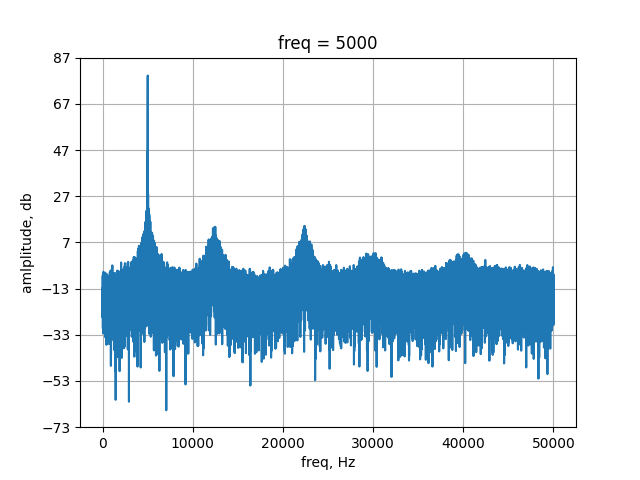

# Отчет по заданию №3

## Quickstart

Запустим Makefile, не меняя ничего в исходниках. Видим следующий вывод

Оба теста успешно пройдены.

 Теперь поменяем исходный код модуля. Запишем в my_signal_1 значение 1.

 ```verilog
 module my_design(input logic clk);

  timeunit 1ns;
  timeprecision 1ns;

  logic my_signal_1;
  logic my_signal_2;

  assign my_signal_1 = 1'b1;
  assign my_signal_2 = 0;

endmodule
 ```
Оба теста снова пройдены, так как не зависят от первого сигнала, но в консоли его значение изменилось


Теперь поменяем my_signal_2, чтобы нарушить тесты.
Получаем сообщение об ошибке


## Matrix Multiplier

После дополнительной установки pytest тест запускается и работает


## NCO

Для этой работы нам нужен генератор m-последовательности

```verilog
module nco_dither_lsfr (clk, rst, out);

parameter OUT_SIZE=5;
parameter LSFR_POLY='b11001001;

localparam LSFR_SIZE=$clog2(LSFR_POLY);

input clk;
input rst; 
output [OUT_SIZE-1:0] out;

reg [LSFR_SIZE-1:0] lsfr;

assign out = lsfr[LSFR_SIZE-1:LSFR_SIZE-OUT_SIZE];

wire lsfr_next;
assign lsfr_next = ^(lsfr & LSFR_POLY);

always @(posedge clk) begin
    if (rst) begin
	    lsfr <= 'b01;
	end
	else
	begin
		lsfr <= {lsfr[LSFR_SIZE-2:0], lsfr_next};
	end
end
endmodule
```

Код самого осцилятора показан ниже

```verilog
`include "nco_dither_lsfr.v"
module NCO (clk, rst, step, out);

  parameter STEP_WIDTH = 16; // integer part of of phase accumulator
  parameter ADDR_WIDTH = 8; // integer part of of phase accumulator
  parameter LUT_WIDTH = 16;

  localparam FRACT_WIDTH = STEP_WIDTH-ADDR_WIDTH; // fractional part of phase accumulator

  input clk;
  input rst;
  input [STEP_WIDTH-1:0] step; // defines sinwave frequency
  output reg signed [LUT_WIDTH-1:0] out;

  reg signed [LUT_WIDTH-1:0] LUT [2**ADDR_WIDTH-1:0];
  reg [STEP_WIDTH+FRACT_WIDTH-1:0] ph_accum;


  // RTL code for phase accumulator'

  always @(posedge clk)
  begin
    if (rst)
      ph_accum <= 0;
    else
      ph_accum <= ph_accum + step;
  end


  // generate SIN LUT contents
  localparam PI = $atan(1)*4.0;
  // Potentially here can be troubles in 'initial'
  // if yes, then generate file from other lang and use `$readmemb` or `$readmemh`

  initial begin: loot_gen
    real phase;
    for (phase = 0; phase < 2.0**ADDR_WIDTH; phase = phase+1.0) begin
      LUT[$rtoi(phase)] = $floor(($sin(2*PI * phase / 2.0**ADDR_WIDTH)) * 2**(LUT_WIDTH-2) );
    end
  end

  // dither generation
  wire [1:0]dither;
  //assign dither = 0; // replace with line by LSFR module instantiation to get dither value
  nco_dither_lsfr #(.OUT_SIZE(2)) lsfr(.clk(clk), .rst(rst), .out(dither));
  // addr generation
  reg [ADDR_WIDTH-1:0] addr;

  always @(posedge clk)
  begin
    if (rst)
      addr <= 0;
    else
      addr <= dither + ph_accum [ADDR_WIDTH+FRACT_WIDTH-1:FRACT_WIDTH];
  end


  // LUT ouput generation from ROM
  always @ (posedge clk)
  begin
    out <= LUT[addr];
  end

endmodule
```

Для тестов были выбраны следующие данные: частота дискретизации = 1МГц, частоты синусов = 5кГц, 10кГц, 15кГц, ширина адреса таблицы = 16 бит.

Результаты с выключенным dithering


Результаты с включенным dithering




